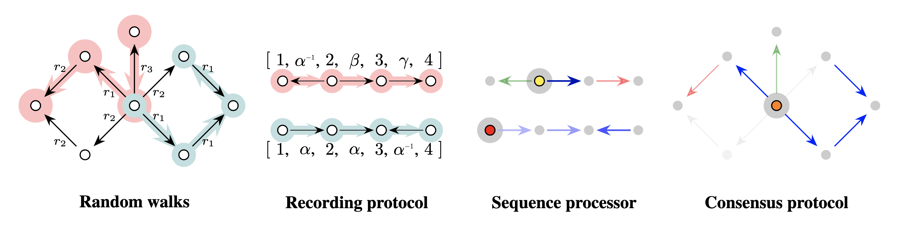

# Flock (PyTorch)

[](https://arxiv.org/abs/2510.01510) \
**Flock: A Knowledge Graph Foundation Model via Learning on Random Walks** \
[Jinwoo Kim*](https://jw9730.github.io), [Xingyue Huang*](https://www.cs.ox.ac.uk/people/xingyue.huang/), [Krzysztof Olejniczak](https://scholar.google.com/citations?user=0DqGU5oAAAAJ&hl=en), [Kyungbin Min](https://vllab.kaist.ac.kr/members.php), [Michael Bronstein](https://www.cs.ox.ac.uk/people/michael.bronstein/), [Seunghoon Hong](https://maga33.github.io), [İsmail İlkan Ceylan](https://www.cs.ox.ac.uk/people/ismaililkan.ceylan/) (* equal contribution) \
arXiv 2025



This codebase contains training and evaluation scripts for Flock, including pretraining scripts and checkpoints on FB15k-237, WN18RR, and CoDEx Medium, zero-shot and finetuning evaluation over 54 knowledge graphs, and our new synthetic dataset Petals.

The codebase has been tested with NVIDIA H100 GPUs.

## Setup

We recommend using the official PyTorch Docker image with CUDA support.

```bash
docker pull pytorch/pytorch:2.8.0-cuda12.6-cudnn9-devel
docker run -it --gpus all --ipc host --name flock -v /home:/home pytorch/pytorch:2.8.0-cuda12.6-cudnn9-devel bash
```

Assuming the codebase is located at `~/flock` inside Docker container, install the required packages:

```bash
cd ~/flock
pip3 install torch_geometric easydict pybind11
bash install_walker.sh
```

## Pretraining and Evaluation

Entity prediction pretraining

```bash
cd ~/flock
python3 src_entity/pretrain.py --config src_entity/config/pretrain_3g.yaml --gpus [0]
```

Entity prediction evaluation (using the checkpoint at `checkpoints/flock_entity.pth`)

```bash
cd ~/flock
mkdir -p ~/flock/output-entity

# zero-shot
CKPT=~/flock/checkpoints/flock_entity.pth bash scripts/entity_zeroshot.sh

# finetuning
CKPT=~/flock/checkpoints/flock_entity.pth bash scripts/entity_finetune.sh
```

Relation prediction pretraining

```bash
cd ~/flock
python3 src_relation/pretrain.py --config src_relation/config/pretrain_3g.yaml --gpus [0]
```

Relation prediction evaluation (using the checkpoint at `checkpoints/flock_relation.pth`)

```bash
cd ~/flock
mkdir -p ~/flock/output-relation

# zero-shot
CKPT=~/flock/checkpoints/flock_relation.pth bash scripts/relation_zeroshot.sh

# finetuning
CKPT=~/flock/checkpoints/flock_relation.pth bash scripts/relation_finetune.sh
```

## Synthetic Dataset Generation

Execute the following commands to generate the Petals synthetic dataset at `data/petals/`:

```bash
python3 generate_petals.py
```

## References

Our implementation is based on the code from the following repositories:

- [RWNN](https://github.com/jw9730/random-walk) and [graph-walker](https://github.com/kerighan/graph-walker) for random walks and their anonymizations
- [MOTIF](https://github.com/HxyScotthuang/MOTIF) and [ULTRA](https://github.com/DeepGraphLearning/ULTRA) for entity prediction experiments
- [TRIX](https://github.com/yuchengz99/TRIX) for relation prediction experiments

## Citation

If you find our work useful, please consider citing it:

```bib
@article{kim2025flock,
  author    = {Jinwoo Kim and Xingyue Huang and Krzysztof Olejniczak and Kyungbin Min and Michael Bronstein and Seunghoon Hong and İsmail İlkan Ceylan},
  title     = {Flock: A Knowledge Graph Foundation Model via Learning on Random Walks},
  journal   = {arXiv},
  volume    = {abs/2510.01510},
  year      = {2025},
  url       = {https://arxiv.org/abs/2510.01510}
}
```
